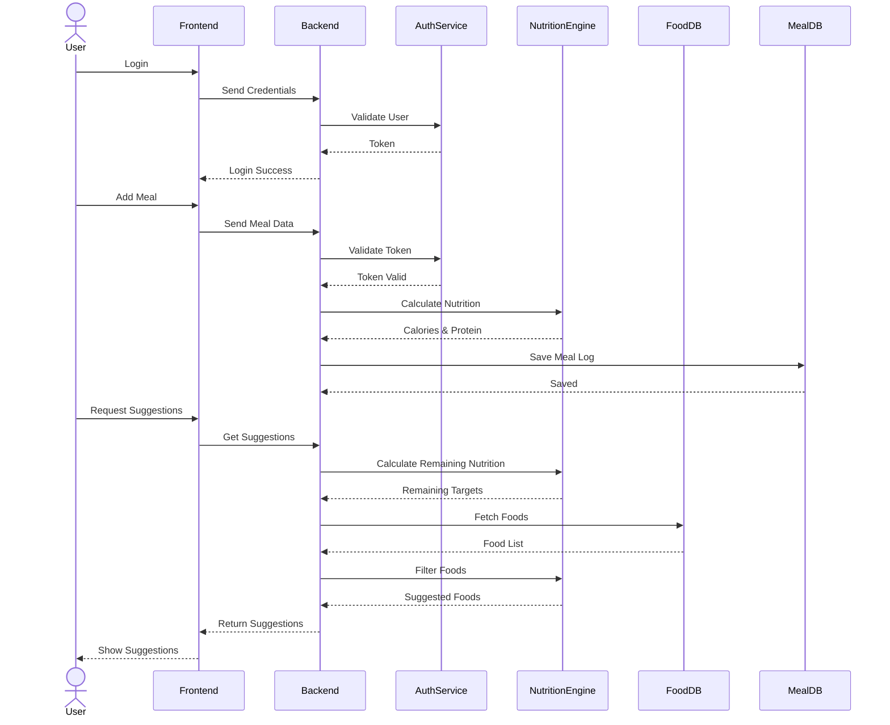

```mermaid
sequenceDiagram
actor User
participant Frontend
participant Backend
participant AuthService
participant NutritionEngine
participant FoodDB
participant MealDB

User->>Frontend: Login
Frontend->>Backend: Send Credentials
Backend->>AuthService: Validate User
AuthService-->>Backend: Token
Backend-->>Frontend: Login Success

User->>Frontend: Add Meal
Frontend->>Backend: Send Meal Data
Backend->>AuthService: Validate Token
AuthService-->>Backend: Token Valid

Backend->>NutritionEngine: Calculate Nutrition
NutritionEngine-->>Backend: Calories & Protein

Backend->>MealDB: Save Meal Log
MealDB-->>Backend: Saved

User->>Frontend: Request Suggestions
Frontend->>Backend: Get Suggestions
Backend->>NutritionEngine: Calculate Remaining Nutrition
NutritionEngine-->>Backend: Remaining Targets

Backend->>FoodDB: Fetch Foods
FoodDB-->>Backend: Food List

Backend->>NutritionEngine: Filter Foods
NutritionEngine-->>Backend: Suggested Foods

Backend-->>Frontend: Return Suggestions
Frontend-->>User: Show Suggestions
```